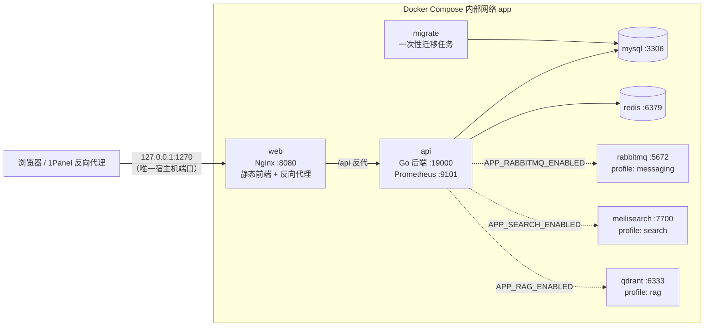

# Notes of Ashen


`Notes of Ashen` 是一个前后端分离的个人博客系统。后端使用 Go 与 go-zero 风格组织代码，前端使用 React、TypeScript、Vite 与 Tailwind CSS 构建页面，部署侧提供 Docker Compose、Nginx 与 1Panel 友好的运行方案。

本机 Docker 默认访问地址：

```text
http://127.0.0.1:1270
```

## 架构



默认只启动 Web、API、MySQL 和 Redis；RabbitMQ、Meilisearch、Qdrant 分别属于 `messaging`、`search`、`rag` Compose profile，必须同时打开对应能力开关才会启动。搜索关闭时 API 自动回退 MySQL 查询；Qdrant 只保存可由文章重建的向量索引。

## 功能概览

- 用户认证：注册、登录、退出、刷新 Token（HttpOnly Cookie）、找回密码；图形验证码与邮箱验证码；`user` / `editor` / `admin` 三级角色。
- 文章管理：草稿、发布、归档、定时发布、置顶与显示优先级、版本查看与恢复、Markdown 导入/导出、SEO 字段。
- 内容展示：公开列表与详情、上下篇与相关文章、按年月日展开的归档、点赞反馈、字数与预计阅读时长、文章目录、原生分享/复制链接。
- Markdown 渲染：代码高亮（语言按需加载）、LaTeX 数学公式、Mermaid 图表、GFM 表格、图片灯箱。
- AI 辅助创作（可选）：一键补全文章标题、slug、摘要、SEO 信息与分类/标签建议，摘要、润色、纠错、扩写、缩写、翻译；支持 `openai` 与 `anthropic` 两种 API 格式。
- RAG 知识库问答（可选）：基于公开文章分段向量的 SSE 流式问答，私有会话历史，后台索引全量重建。
- 全文搜索（可选）：Meilisearch 搜索与搜索建议，搜索关闭时回退 MySQL 查询。
- 分类与标签：公开与后台文章数量展示，后台可创建、更新和删除。
- 媒体库：本地持久化 JPEG/PNG/GIF/WebP/AVIF，内容 SHA-256 哈希去重，内容寻址静态服务与长期缓存。
- 管理后台：仪表盘、用户管理、站点设置、项目管理、操作日志、页面/文章内容分析、依赖健康探测、口令加密备份与整站恢复。
- 流量统计：公开页面自动上报 PV、UV 与来源，后台展示最近 30 天趋势。
- 站点能力：RSS、Sitemap、SEO 动态 meta、可选 Prerender.io 预渲染、PWA、深色模式（跟随系统）、自定义主题强调色、中英双语界面。
- 安全设施：JWT + bcrypt、Redis 多维限流、可信反向代理链校验、AI 出口 SSRF 防护、CSP 安全头、非 root 容器运行。
- 异步日志：通过 RabbitMQ 投递操作事件，并写入 `operation_logs`。
- 统一响应：接口成功时返回 `{ "code": 0, "message": "success", "data": ... }`。

## 技术栈

- 后端：Go 1.25、go-zero REST、MySQL 8.4、Redis 7.4、JWT、bcrypt；可选 Meilisearch 1.13、Qdrant 1.16 + DashScope、RabbitMQ 4。
- 前端：React 18、TypeScript、Vite 5、Tailwind CSS 4、Zustand、Axios、Framer Motion、ECharts、react-markdown、KaTeX、Mermaid。
- 部署：Docker Compose（镜像 digest 锁定）、Nginx、1Panel。

## 快速开始

前置要求：Git、Docker Desktop（或 Linux 服务器上的 Docker Engine）与 Docker Compose。

```bash
git clone https://github.com/Elari39/Notes-of-Ashen.git
cd Notes-of-Ashen

cp .env.example .env
# Windows PowerShell 使用：Copy-Item .env.example .env
```

编辑 `.env`，替换所有 `<REPLACE_…>` 占位符——后端启动会拒绝空值、占位值和过短的 JWT 密钥：

```bash
docker compose config --quiet
docker compose up -d --build
```

启动完成后访问 `http://127.0.0.1:1270`，注册第一个用户。默认逻辑下，第一个注册用户会成为管理员；如果邮箱服务保持默认关闭，首个管理员注册会自动跳过邮箱验证码，后续注册仍需要先启用并配置邮箱验证码能力。

需要 RabbitMQ、Meilisearch 或 Qdrant 时，请在 `.env` 中同时设置 `COMPOSE_PROFILES` 与对应能力开关、凭据，详见 [docs/DEPLOYMENT.md](docs/DEPLOYMENT.md)。

## 项目结构

```text
.
├── api/                               # go-zero API 契约描述文件
├── cmd/notes-of-ashen/                # 后端服务入口
├── deploy/
│   ├── mysql/migrations/              # 不可变编号数据库迁移（embed 内嵌）
│   ├── nginx/                         # 前端 Nginx 生产配置与安全头
│   └── test/                          # 集成测试用 Compose 变体
├── docs/                              # API / 部署 / 运维 / 测试文档
├── etc/                               # 后端默认配置文件
├── frontend/                          # React 前端应用（含 e2e 测试）
├── internal/                          # 后端内部模块（handler/logic/config 等）
├── model/                             # 数据访问层
├── scripts/                           # release / backup / 集成测试 PowerShell 脚本
├── test/                              # 集成测试代码与夹具
├── Dockerfile.api                     # Go API 镜像构建文件
├── Dockerfile.web                     # 前端 Nginx 镜像构建文件
├── docker-compose.yml                 # Docker Compose 编排文件
├── docker-compose.external-redis.yml  # 外部 Redis 覆盖编排
├── AGENTS.md                          # AI 编码代理协作规范
├── DESIGN.md                          # 前端设计系统文档
└── .env.example                       # 环境变量模板
```

## 本地非 Docker 开发

非 Docker 开发时，需要自行准备 MySQL 和 Redis；仅在启用异步日志、搜索或 RAG 时再准备 RabbitMQ、Meilisearch 或 Qdrant，并根据 [etc/notes-of-ashen.yaml](etc/notes-of-ashen.yaml) 修改连接信息，或通过 `APP_*` 环境变量覆盖配置。

### 启动后端

```bash
go mod tidy
go run ./cmd/notes-of-ashen -f etc/notes-of-ashen.yaml
```

后端默认监听 `http://127.0.0.1:19000`。

### 启动前端

前端必须使用 `pnpm` 管理依赖（需要 Node.js 22）：

```bash
cd frontend
pnpm install
pnpm dev
```

开发服务器默认监听 `http://127.0.0.1:3000`。Vite 开发代理会将 `/api` 与 `/media` 转发到 `http://127.0.0.1:19000`，可通过 `VITE_API_TARGET` 环境变量覆盖为远程后端地址。

## 常用验证命令

后端：

```bash
go test ./...
go vet ./...
go build ./...
```

前端（`pnpm build` 会依次执行 lint、类型检查、Vite 生产构建和包体积检查）：

```bash
cd frontend
pnpm lint
pnpm type-check
pnpm test
pnpm build
```

E2E 与集成测试：

```bash
cd frontend
pnpm test:e2e:install
pnpm test:e2e
```

```powershell
pwsh scripts/test-integration.ps1 -Suite core
```

Docker 配置校验：

```bash
docker compose config --quiet
```

## 文档索引

| 文档 | 内容 |
| --- | --- |
| [docs/API.md](docs/API.md) | 接口文档：路由、参数、统一响应与错误码、PowerShell 调用示例 |
| [docs/DEPLOYMENT.md](docs/DEPLOYMENT.md) | 部署指南：全量环境变量清单、可选能力配置、1Panel 部署、发布回滚、数据持久化、常见问题 |
| [docs/OPERATIONS.md](docs/OPERATIONS.md) | 运维手册：备份策略、异地副本、恢复演练、发布与回滚 |
| [docs/TESTING.md](docs/TESTING.md) | 测试说明：真实集成测试、前端构建与包体积、CI |
| [DESIGN.md](DESIGN.md) | 前端设计系统：颜色、排版、布局、组件规范 |
| [frontend/README.md](frontend/README.md) | 前端子项目开发说明 |
| [AGENTS.md](AGENTS.md) | AI 编码代理协作规范 |

## 维护建议

- 备份、异地副本、恢复演练与发布回滚的完整运维流程见 [docs/OPERATIONS.md](docs/OPERATIONS.md)；日常备份使用 `pwsh scripts/backup.ps1`，正式发布使用 `pwsh scripts/release.ps1`。
- 生产环境务必填写真实强随机密码替换所有 `<REPLACE_…>` 占位符，并设置稳定、足够长的 `APP_AUTH_ACCESS_SECRET`；注意 AI API Key 密文由该密钥派生，轮换时需重新录入。
- 前端依赖管理统一使用 `pnpm`，不要混用 `npm` 或 `yarn`。
- 不要提交 `.env`、数据库备份、日志文件或任何真实密钥；数据库备份建议放在仓库目录外。
- 升级前先备份 MySQL 数据卷或远程 MySQL 数据，并确认 Redis、RabbitMQ 的持久化策略符合预期；数据库结构由 [deploy/mysql/migrations](deploy/mysql/migrations) 不可变编号迁移统一管理，修复只能新增前向迁移。
- 修改后建议至少运行上方"常用验证命令"中的后端与前端检查。
