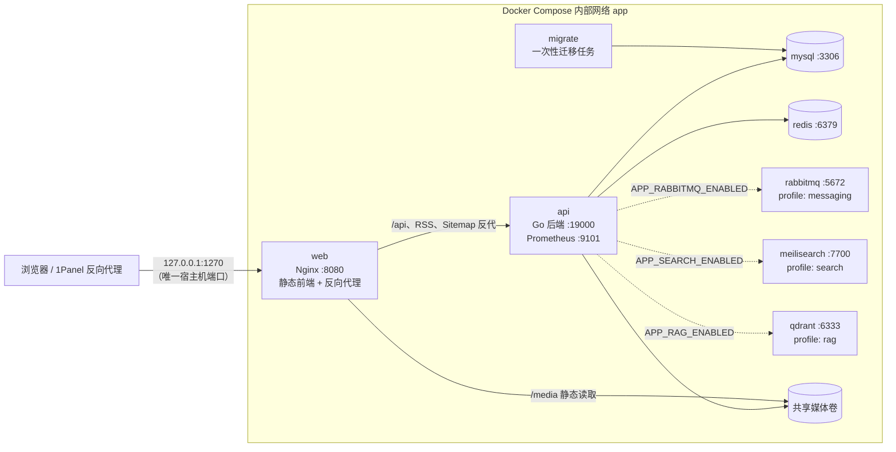

# Notes of Ashen


`Notes of Ashen` 是一个前后端分离的个人博客系统。后端使用 Go 与 go-zero 风格组织代码，前端使用 React、TypeScript、Vite 与 Tailwind CSS 构建页面，部署侧提供 Docker Compose、Nginx 与 1Panel 友好的运行方案。

[线上博客](https://blog.miku831.fun/) · [源码仓库](https://github.com/Elari39/Notes-of-Ashen) · [项目详解](https://elari39.github.io/projects/notes-of-ashen/) · [灰烬女巫的魔典](https://elari39.github.io/)

本机 Docker 默认访问地址：[http://127.0.0.1:1270](http://127.0.0.1:1270)。

## 目录

- [架构](#架构)
- [功能概览](#功能概览)
- [技术栈](#技术栈)
- [快速开始](#快速开始)
- [可选能力与配置入口](#可选能力与配置入口)
- [项目结构](#项目结构)
- [本地非 Docker 开发](#本地非-docker-开发)
- [常用验证命令](#常用验证命令)
- [迁移说明](#迁移说明)
- [发布与回滚](#发布与回滚)
- [文档索引](#文档索引)
- [维护建议](#维护建议)
- [许可](#许可)

## 架构


```mermaid
flowchart LR
    U["浏览器 / 1Panel 反向代理"] -->|"127.0.0.1:1270<br/>（唯一宿主机端口）"| W

    subgraph compose["Docker Compose 内部网络 app"]
        W["web<br/>Nginx :8080<br/>静态前端 + 反向代理"]
        A["api<br/>Go 后端 :19000<br/>Prometheus :9101"]
        MG["migrate<br/>一次性迁移任务"]
        M[("mysql :3306")]
        R[("redis :6379")]
        MQ["rabbitmq :5672<br/>profile: messaging"]
        ME["meilisearch :7700<br/>profile: search"]
        Q["qdrant :6333<br/>profile: rag"]

        W -->|"/api、RSS、Sitemap 反代"| A
        W -->|"/media 静态读取"| MD[("共享媒体卷")]
        A --> MD
        MG --> M
        A --> M
        A --> R
        A -. "APP_RABBITMQ_ENABLED" .-> MQ
        A -. "APP_SEARCH_ENABLED" .-> ME
        A -. "APP_RAG_ENABLED" .-> Q
    end
```

默认常驻服务是 Web、API、MySQL 和 Redis，启动时还会运行 `config-check`、`migrate`、`public-site-check` 三个一次性任务。数据库迁移与配置检查成功后才启动 API。RabbitMQ、Meilisearch、Qdrant 分别属于 `messaging`、`search`、`rag` Compose profile；profile 与能力开关必须一致，否则启动检查失败。

业务请求按 `handler → logic → model.Store` 分层，统一响应由 `internal/response` 处理。业务接口前缀是 `/api/v1`，`/healthz`、`/rss.xml`、`/sitemap.xml` 与 `/media/:key` 位于根路径。搜索关闭或调用失败时回退 MySQL；RabbitMQ 关闭时操作日志直接写 MySQL；Qdrant 保存可由文章重建的向量索引。

## 功能概览

- 用户认证：注册、登录、退出、刷新 Token（HttpOnly Cookie）、找回密码；图形验证码与邮箱验证码；`user` / `editor` / `admin` 三级角色。
- 文章管理：草稿、发布、归档、定时发布、置顶与显示优先级、版本查看与恢复、Markdown 导入/导出、SEO 字段。
- 内容展示：公开列表与详情、上下篇与相关文章、按年月日展开的归档、点赞反馈、字数与预计阅读时长、文章目录、原生分享/复制链接。
- Markdown 渲染：代码高亮（语言按需加载）、LaTeX 数学公式、Mermaid 图表、GFM 表格、图片灯箱。
- AI 辅助创作（可选）：一键补全文章标题、slug、摘要、SEO 信息与分类/标签建议，摘要、润色、纠错、扩写、缩写、翻译；支持 `openai` 与 `anthropic` 两种 API 格式。
- RAG 知识库问答（可选）：基于公开文章分段向量的 SSE 流式问答，私有会话历史，后台索引全量重建。
- 全文搜索（可选）：Meilisearch 搜索与搜索建议，搜索关闭时回退 MySQL 查询。
- 分类与标签：公开与后台文章数量展示，后台可创建、更新和删除。
- 媒体库：本地持久化 JPEG/PNG/GIF/WebP/AVIF，内容 SHA-256 哈希去重，内容寻址静态服务与长期缓存。
- 管理后台：仪表盘、用户管理、站点设置、项目管理、操作日志、页面/文章内容分析、依赖健康探测、口令加密备份与整站恢复。
- 流量统计：公开页面自动上报 PV、UV 与来源，后台展示最近 30 天趋势。
- 站点能力：RSS、Sitemap、SEO 动态 meta、可选 Prerender.io 预渲染、PWA、浅色／深色／跟随系统、自定义主题强调色、中英双语界面。目前六种风格为原有刊物、柔和新粗野、日式纸本、瑞士平面、经典新粗野、暗色书房，清单以 `frontend/src/store/themeStyles.ts` 为准。
- 主题入口：导航栏「偏好 → 主题风格」（手机端先打开菜单）。风格与浅色／深色模式独立选择，保存到当前浏览器；默认保留原有刊物风格，自定义主题色会跨风格保留，「重置」恢复当前风格的默认色。
- 安全设施：JWT + bcrypt、Redis 多维限流、可信反向代理链校验、AI 出口 SSRF 防护、CSP 安全头、非 root 容器运行。
- 异步日志：通过 RabbitMQ 投递操作事件，并写入 `operation_logs`。
- 统一响应：接口成功时返回 `{ "code": 0, "message": "success", "data": ... }`。

## 技术栈

- 后端：Go 1.27、go-zero REST、MySQL 8.4、Redis 7.4、JWT、bcrypt；可选 Meilisearch 1.13、Qdrant 1.16 + DashScope、RabbitMQ 4。
- 前端：React 18、TypeScript、Vite 6、Tailwind CSS 4、Zustand、Axios、Framer Motion、ECharts、react-markdown、KaTeX、Mermaid。
- 部署：Docker Compose（镜像 digest 锁定）、Nginx、1Panel。

本地工具链使用 Go **1.27.1**、Node.js **22**、pnpm **9.15.9**；版本来源分别是 `go.mod`、CI / Dockerfile 和 `frontend/package.json`。依赖精确解析版本以锁文件为准。

## 快速开始

前置要求：Git、Docker Desktop（或 Linux 服务器上的 Docker Engine）与 Docker Compose。

```bash
git clone https://github.com/Elari39/Notes-of-Ashen.git
cd Notes-of-Ashen

cp .env.example .env
# Windows PowerShell 使用：Copy-Item .env.example .env
```

编辑 `.env`，替换所有 `<REPLACE_…>` 占位符。MySQL 密码需要同时填入 `APP_MYSQL_PASSWORD` 与 `APP_DATABASE_DSN`，`IMAGE_TAG` 改为本次版本号或提交标识；后端会拒绝空值、占位值和过短的 JWT 密钥。

本机使用 `http://127.0.0.1:1270` 时，将 **`APP_AUTH_COOKIE_SECURE=false`**；否则刷新令牌 Cookie 无法在 HTTP 开发环境正常使用。`APP_REQUIRE_PUBLIC_SITE_URL` 保持 `false`。生产 HTTPS 部署恢复 `APP_AUTH_COOKIE_SECURE=true`。

```bash
docker compose config --quiet
docker compose up -d --build
```

启动完成后访问 `http://127.0.0.1:1270`，注册第一个用户。默认逻辑下，第一个注册用户会成为管理员；如果邮箱服务保持默认关闭，首个管理员注册会自动跳过邮箱验证码，后续注册仍需要先启用并配置邮箱验证码能力。

需要 RabbitMQ、Meilisearch 或 Qdrant 时，请在 `.env` 中同时设置 `COMPOSE_PROFILES` 与对应能力开关、凭据，详见 [docs/DEPLOYMENT.md](docs/DEPLOYMENT.md)。

## 可选能力与配置入口

| 能力 | 进程 / Compose 配置 | 后台配置与关闭时行为 |
| --- | --- | --- |
| 邮箱验证码 | `APP_EMAIL_ENABLED` 与 `APP_EMAIL_SMTP_*` | 无 Compose profile；关闭时仅空用户表的首次管理员注册可跳过邮箱验证码 |
| 全文搜索 | `COMPOSE_PROFILES=search`、`APP_SEARCH_ENABLED=true`、`APP_MEILISEARCH_*` | 关闭或服务异常时回退 MySQL 查询；可从后台重建索引 |
| 异步操作日志 | `COMPOSE_PROFILES=messaging`、`APP_RABBITMQ_ENABLED=true`、匹配的账号、密码与 URL | 关闭时同步写入 `operation_logs`，不意味着关闭审计日志 |
| AI 写作 | 无进程级 AI Key 变量 | 管理后台 AI 设置保存 endpoint、API 格式、模型及密钥；未配置时不可用 |
| RAG 问答 | `COMPOSE_PROFILES=rag`、`APP_RAG_ENABLED=true`、`APP_QDRANT_*` | 后台另设 DashScope 地址、模型、密钥和问答页开关；配置和索引就绪后才能问答 |
| 爬虫预渲染 | Web 容器的 `PRERENDER_ENABLED`、`PRERENDER_SERVICE_URL`、`PRERENDER_TOKEN` | 默认关闭；应用前端仍是 SPA |

AI 写作与 RAG 的提供方配置都保存于 MySQL `site_settings`，不在 YAML、`.env` 或前端构建变量中存放 API Key。Qdrant 连接配置属于后端进程，与 DashScope 提供方配置分开。多个 profile 用逗号分隔，例如 `search,messaging,rag`。

## 项目结构

```text
.
├── api/                               # go-zero API 契约描述文件
├── cmd/notes-of-ashen/                # 后端服务入口
├── deploy/
│   ├── mysql/migrations/              # 不可变编号数据库迁移（embed 内嵌）
│   ├── nginx/                         # 前端 Nginx 生产配置与安全头
│   └── test/                          # 集成测试用 Compose 变体
├── docs/                              # API / 部署 / 运维 / 测试文档
├── etc/                               # 后端默认配置文件
├── frontend/                          # React 前端应用（含 e2e 测试）
├── internal/                          # 后端内部模块（handler/logic/config 等）
├── model/                             # 数据访问层
├── scripts/                           # release / backup / 集成测试 PowerShell 脚本
├── test/                              # 集成测试代码与夹具
├── Dockerfile.api                     # Go API 镜像构建文件
├── Dockerfile.web                     # 前端 Nginx 镜像构建文件
├── docker-compose.yml                 # Docker Compose 编排文件
├── docker-compose.external-redis.yml  # 外部 Redis 覆盖编排
├── AGENTS.md                          # AI 编码代理协作规范
├── DESIGN.md                          # 前端设计系统文档
└── .env.example                       # 环境变量模板
```

## 本地非 Docker 开发

非 Docker 开发时，需要自行准备 MySQL 8.4 数据库 `notes_of_ashen` 和 Redis。默认 Compose 不向宿主暴露数据库端口，不能直接把其中的 `mysql:3306` / `redis:6379` 地址用于宿主 Go 进程。

配置优先级为：**真实环境变量 → `.env` → YAML 默认值**。入口默认读取工作目录的 `.env`，可用 `APP_ENV_FILE` 指定另一份本地文件；解析器不展开 `${变量}` 引用。参考 [.env.example](.env.example) 配置至少以下项：

| 变量 | 本地直跑要求 |
| --- | --- |
| `APP_DATABASE_DSN` | 指向宿主可达的 MySQL；保留 `parseTime=true`，使用独立开发库 |
| `APP_AUTH_ACCESS_SECRET` | 自行生成稳定的强随机密钥，至少 16 字节 |
| `APP_REDIS_ADDR` / `APP_REDIS_PASSWORD` | 指向开发 Redis，与实例认证配置一致 |
| `APP_AUTH_COOKIE_SECURE` | HTTP 开发设为 `false` |
| `APP_MEDIA_ROOT` | 使用可写的 `./data/media` 等本地路径，勿照抄容器路径 `/data/media` |
| `APP_TRUSTED_PROXY_CIDRS` | 直连时留空；只有实际受信代理才加入 |

可选服务保持关闭即可开发核心博客。使用外部可选服务且不使用 Compose 时，可不设置 `COMPOSE_PROFILES`；一旦定义该变量，后端会检查它与能力开关的一致性。

### 启动后端

```bash
go mod download
# 首次启动及升级后先执行迁移；普通 API 启动不会代跑迁移。
go run ./cmd/notes-of-ashen -f etc/notes-of-ashen.yaml -migrate-only
go run ./cmd/notes-of-ashen -f etc/notes-of-ashen.yaml
```

后端默认在 `0.0.0.0:19000` 监听，可通过 `http://127.0.0.1:19000/healthz` 检查；仅本机开发时可设置 `APP_HOST=127.0.0.1`。Redis 是启动必需依赖，连接或认证失败会使 API 退出。

### 启动前端

前端必须使用 `pnpm` 管理依赖（需要 Node.js 22）：

```bash
cd frontend
pnpm install --frozen-lockfile
pnpm dev
```

开发服务器默认监听 `http://127.0.0.1:3000`。Vite 开发代理会将 `/api` 与 `/media` 转发到 `http://127.0.0.1:19000`，可通过 `VITE_API_TARGET` 环境变量覆盖为远程后端地址。

## 常用验证命令

后端：

```bash
go test ./...
go vet ./...
go build ./...
```

前端（`pnpm build` 会依次执行 lint、类型检查、Vite 生产构建和包体积检查）：

```bash
cd frontend
pnpm lint
pnpm type-check
pnpm test
pnpm build
```

完整 E2E 与集成测试使用仓库根目录的编排脚本，需 Docker Compose、Go、PowerShell 7、pnpm 和已安装的前端依赖：

```powershell
pwsh scripts/test-integration.ps1 -Suite core
# 更完整的并发、故障注入与恢复测试（包含 core）
pwsh scripts/test-integration.ps1 -Suite extended
```

脚本创建隔离的容器、卷、随机凭据和回环端口，不读取真实 `.env`，并自动提供 E2E 所需变量与浏览器。直接在 `frontend/` 执行 `pnpm test:e2e` **不会启动后端**，需要已准备好的测试栈及 `E2E_WEB_BASE_URL`、`E2E_API_BASE_URL`、`E2E_REDIS_URL`；使用编排脚本是完整验收的入口。

普通 `go test ./...` 不等于运行了全部真实服务测试；部分用例只有提供测试 DSN / E2E 环境后才运行。测试范围、主题专项和 WebKit 离线模拟的已知限制见 [docs/TESTING.md](docs/TESTING.md)，不能用某个专项通过代替完整套件通过。

Docker 配置校验：

```bash
docker compose config --quiet
```

该配置检查应在本地环境文件已经填写后执行。前端 CI 跑 `pnpm test` 与 `pnpm build`；集成 CI 在 push / PR 上跑 `core`，在 main push、手动触发及每日上海时间 02:00 跑 `extended`，以实际 Actions 结果为准。

## 迁移说明

数据库结构由 [deploy/mysql/migrations](deploy/mysql/migrations) 内嵌的编号迁移管理，校验已应用文件的 checksum。已应用迁移不可重写；结构修复新增前向迁移。Compose 的 `migrate` 任务自动执行，本地直跑使用上面的 `-migrate-only`。

```bash
# 代码内嵌的最新迁移版本（不连接数据库）
go run ./cmd/notes-of-ashen -migration-version
# 当前数据库的已应用版本（需要配置开发或目标数据库）
go run ./cmd/notes-of-ashen -schema-version
```

AI 写作密钥采用 `v3:` 密文，由 `APP_AUTH_ACCESS_SECRET` 派生独立用途的加密密钥；`v2:` 旧密文需管理员重新录入，无前缀旧密文可兼容读取并在保存时迁移。RAG 密钥也依赖认证密钥派生。轮换认证密钥前保存必要凭据，轮换后核对并重新录入 AI / RAG Key。

## 发布与回滚

生产入口为 Nginx 后的 HTTPS 域名。先在管理后台将 `siteBaseUrl` 设置为正式 HTTPS 地址，再启用 `APP_REQUIRE_PUBLIC_SITE_URL=true`；`public-site-check` 和 API 启动都会验证它。首次初始化需先完成管理员注册和该设置，再开启强制检查。

```powershell
# 已配置的运维环境中执行；备份默认保留 14 天
pwsh scripts/backup.ps1
# 从干净工作区构建不可变镜像并发布
pwsh scripts/release.ps1
```

代码回退用 `pwsh scripts/release.ps1 -Rollback <旧tag>`，要求本地旧镜像存在且迁移版本兼容；它不会回退数据库结构。数据库与媒体恢复使用匹配的备份，完整流程见 [docs/OPERATIONS.md](docs/OPERATIONS.md)。

### 生产发布验收清单

- 确认 `/healthz`、管理员登录和刷新会话正常，生产 Cookie 带 `Secure`。
- 核对 `/rss.xml`、`/sitemap.xml` 与文章分享地址使用正式 HTTPS 域名。
- 确认可信代理 CIDR 对应实际代理链，MySQL、Redis、指标端口不公开暴露。
- 验证文章发布与媒体读取；启用搜索、AI 或 RAG 时分别验证其配置和索引状态。
- 保存镜像版本、迁移版本、数据库与媒体备份；数据库备份脚本生成的压缩包本身不加密，后台 `.noa-backup` 导出包才是口令加密格式。

## 文档索引

| 文档 | 内容 |
| --- | --- |
| [docs/API.md](docs/API.md) | 接口文档：路由、参数、统一响应与错误码、PowerShell 调用示例 |
| [docs/DEPLOYMENT.md](docs/DEPLOYMENT.md) | 部署指南：全量环境变量清单、可选能力配置、1Panel 部署、发布回滚、数据持久化、常见问题 |
| [docs/OPERATIONS.md](docs/OPERATIONS.md) | 运维手册：备份策略、异地副本、恢复演练、发布与回滚 |
| [docs/TESTING.md](docs/TESTING.md) | 测试说明：真实集成测试、前端构建与包体积、CI |
| [DESIGN.md](DESIGN.md) | 前端设计系统：颜色、排版、布局、组件规范 |
| [frontend/README.md](frontend/README.md) | 前端子项目开发说明 |
| [AGENTS.md](AGENTS.md) | AI 编码代理协作规范 |

## 维护建议

- 备份、异地副本、恢复演练与发布回滚的完整运维流程见 [docs/OPERATIONS.md](docs/OPERATIONS.md)；日常备份使用 `pwsh scripts/backup.ps1`，正式发布使用 `pwsh scripts/release.ps1`。
- 生产环境务必填写真实强随机密码替换所有 `<REPLACE_…>` 占位符，并设置稳定、足够长的 `APP_AUTH_ACCESS_SECRET`；注意 AI API Key 密文由该密钥派生，轮换时需重新录入。
- 前端依赖管理统一使用 `pnpm`，不要混用 `npm` 或 `yarn`。
- 不要提交 `.env`、数据库备份、日志文件或任何真实密钥；数据库备份建议放在仓库目录外。
- 升级前先备份 MySQL 数据卷或远程 MySQL 数据，并确认 Redis、RabbitMQ 的持久化策略符合预期；数据库结构由 [deploy/mysql/migrations](deploy/mysql/migrations) 不可变编号迁移统一管理，修复只能新增前向迁移。
- 修改后建议至少运行上方"常用验证命令"中的后端与前端检查。

## 许可

当前仓库未提供项目级 `LICENSE`，不应将依赖库的许可证视为本项目源码或博客内容的授权。
