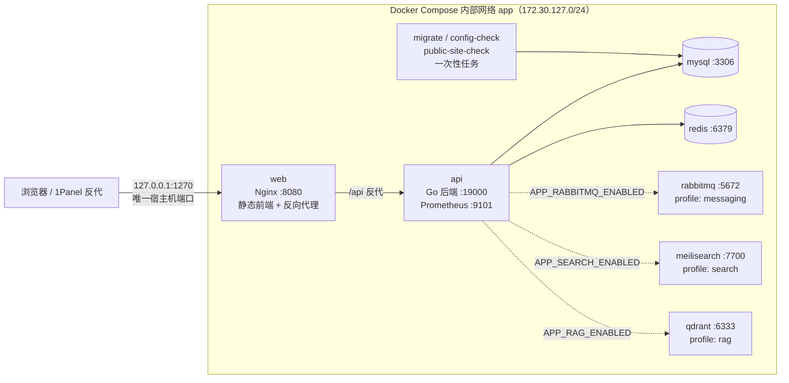

# 01 · 项目全景与端到端串讲

> 这一册是**总纲**。目标是让你被问「介绍一下你的项目」时，能立刻给出有结构、有细节、有取舍的回答。
> 机制细节不在这里展开，指向同目录其它分册。
>
> 本文基于提交 `0ef4c68` 的代码整理。

---

## 本册速记卡

- **一句话**：前后端分离的个人博客系统，Go + go-zero 后端、React + TS 前端、Docker Compose 部署，额外集成了 **AI 辅助写作** 和 **RAG 知识库问答**。
- **规模**：Go 约 3.0 万行（含测试）、前端约 2.0 万行、131 次提交、2026-06-06 起约 3.5 个月、28 个数据库迁移。
- **架构关键点**：宿主机只暴露一个端口 `127.0.0.1:1270`；Nginx 同时提供静态前端和 `/api` 反向代理；MySQL/Redis 是核心依赖，RabbitMQ/Meilisearch/Qdrant 是可选能力（Compose profile 控制，关闭时后端自动降级）。
- **AI 关键点**：AI 配置只存数据库、Key 加密；RAG 走「切段 → embedding → Qdrant → 检索 → 重排 → 提示词 → SSE 流式」。
- **两端串讲**：会讲「一次文章详情请求」和「一次 RAG 提问」这两条完整链路。

---

## 主题：项目是做什么的

### ① 一句话答案

一个**自用的个人博客系统**：对外是文章阅读站（列表、详情、归档、搜索、分类标签、RSS/Sitemap），对内是内容管理后台（写文章、媒体库、用户与角色、站点设置、流量与内容分析、加密备份恢复），并额外做了两块 AI 能力：**AI 辅助写作**和**基于自己文章的知识库问答**。

### ② 展开讲 30–60 秒

普通的博客系统只有「写文章 + 展示文章」。我给自己的要求是：**把我学到的技术都真正用一遍，并且保证每一块都可以关掉而不影响主流程**。

所以功能上分了三层：

- **核心层（必须可用）**：认证、文章与版本、分类标签、媒体库、站点设置、管理后台。只依赖 MySQL + Redis。
- **可选增强层（可以关）**：异步操作日志（RabbitMQ）、全文搜索（Meilisearch）、抓取预渲染（Prerender）。
- **AI 层（可以关）**：AI 辅助写作（一键补全标题/slug/摘要/SEO/分类标签建议、润色、纠错、扩写、缩写、翻译）、RAG 知识库问答（SSE 流式 + 私有会话历史 + 后台全量重建索引）。

这样设计的好处是：部署门槛低（默认只要 4 个容器），而想体验 AI 的人再打开对应开关即可。

### ③ 代码落点

- 功能总览：`README.md` 的「功能概览」一节
- 可选能力的开关与降级：`.env.example`、`docker-compose.yml:313`（`profiles: ["messaging"]`）、`:347`（`search`）、`:380`（`rag`）
- 路由全集：`internal/handler/routes.go:58`（公开）、`:82`（需登录）、`:142`（上传）

### ④ 可能的追问 + 应答

- **Q：为什么不直接用现成的博客（Hexo / WordPress / Halo）？**
  A：现成方案能省时间，但拿不到工程上的东西。我要的是「有真实并发、有鉴权、有数据库迁移、有部署和备份」的场景，这样才能真正练到后端工程能力；AI 部分更是现成博客插件给不了的。

- **Q：为什么不用 Next.js 做全栈？**
  A：我刻意选了前后端分离，就是想练 Go。而且 SSR 对我的场景收益不大——博客主要是静态内容，我改成用 Prerender 给爬虫做预渲染，成本更低。（诚实边界：Prerender 是可选能力，本地默认关闭。）

- **Q：一个人做的？**
  A：是。用 git 提交记录可以看出来（131 次提交，约 3.5 个月）。**如实回答你的参与程度，不要编团队。**

### ⑤ 诚实边界

- 这是**个人项目**，没有真实线上流量数据。不要编造 DAU、QPS、并发量。
- 「可选能力」的降级路径在代码里有明确实现，但只有在本地 Docker 环境验证过。

---

## 主题：项目规模与技术栈

### ① 一句话答案

Go 1.25 + go-zero REST 后端，React 18 + TypeScript + Vite 5 + Tailwind CSS 4 前端，MySQL 8.4 + Redis 7.4 为核心存储，Docker Compose + Nginx 部署；AI 部分可选接 Qdrant + DashScope。

### ② 展开讲 30–60 秒

按层说更清楚：

| 层 | 选型 | 为什么这么选 / 放弃了什么 |
| --- | --- | --- |
| 后端框架 | **go-zero REST** | 自带 `rest` 服务、配置加载、日志、Prometheus 指标，省掉大量胶水代码。放弃了 Gin 的极简与生态广度，换取开箱即用的观测和配置能力 |
| 后端语言 | **Go 1.25** | 编译成单个静态二进制、部署简单、并发模型清晰、内存占用低 |
| 数据库 | **MySQL 8.4** | 关系模型贴合「文章-分类-标签」结构与事务需求；用 InnoDB 全文索引做搜索降级。放弃了 PostgreSQL 的 JSONB/全文检索优势 |
| 缓存与限流 | **Redis 7.4** | 限流、验证码、token 黑名单、流量统计去重、认证用户缓存、RAG 并发租约都靠它 |
| 前端 | **React 18 + TS + Vite 5** | 生态最熟、TS 能约束接口字段、Vite 开发与构建都快 |
| 样式 | **Tailwind CSS 4** | 原子类写起来快，配合 `DESIGN.md` 统一设计系统 |
| 前端状态 | **Zustand** | 比 Redux 轻得多，没有样板代码；把判断逻辑抽成纯函数 `*Policy.ts` 后可单测。放弃了 Redux DevTools 的时间旅行调试 |
| HTTP 客户端 | **Axios** | 拦截器机制适合做统一响应解包、Token 注入、401 刷新 |
| 向量库 | **Qdrant** | 单容器、REST API 简单、支持 payload 过滤（我用它做 epoch 隔离）。放弃 pgvector 是因为不想把向量和业务库耦合 |
| 模型服务 | **DashScope（通义千问）** | 国内可直连、同时提供 chat / embedding / rerank 三类接口。同时抽象了 OpenAI 与 Anthropic 两种兼容格式 |
| 部署 | **Docker Compose + Nginx** | 单机自用足够；Nginx 同时管静态资源和反代。放弃了 K8s（对这个规模是过度设计） |

### ③ 代码落点

- 依赖清单：`go.mod`、`frontend/package.json`
- 编排：`docker-compose.yml`
- 设计系统：`DESIGN.md`

### ④ 可能的追问 + 应答

- **Q：go-zero 你用它哪些能力？**
  A：`rest` 服务与路由注册、`conf` 配置加载、`logx` 日志、内置 Prometheus 指标。**但我也主动关掉了它两个内置中间件**（访问日志、请求体上限），原因在 `cmd/notes-of-ashen/main.go:83` 的注释里——内置访问日志在 5xx 时会转储可能含凭证的请求，内置 MaxBytes 写 413 的方式会被 Nginx 误判 502。详见 `02-Go后端核心机制.md`。

- **Q：为什么后端接口不用 goctl 生成？**
  A：我保留了 `api/notes-of-ashen.api` 作为接口契约来源，但手写 handler/logic，这样分层更可控、逻辑更透明。取舍是失去了一部分代码生成的效率。

- **Q：Zustand 和 Redux 的区别？**
  A：Redux 要求 action/reducer 的严格单向数据流，好处是可预测和调试，代价是样板代码；Zustand 是一个订阅式的 store，直接 `setState`，代码量小。我这个项目状态不复杂，Zustand 更划算。

### ⑤ 诚实边界

- 选型理由里有一部分是**事后合理化的**——真实过程里也有「先用了再评估」。面试时如果被追问，坦诚说「当时主要是想练某个技术，后来发现它在这里确实合适/不合适」比硬编理由更可信。

---

## 主题：整体架构

### ① 一句话答案

宿主机只暴露 **一个端口 `127.0.0.1:1270`**；Nginx 在这个端口上既提供前端静态文件，又把 `/api`、`/media`、`/rss.xml`、`/sitemap.xml` 反代到 Go API；API 通过 Compose 内部网络访问 MySQL、Redis，以及可选的 RabbitMQ、Meilisearch、Qdrant。

### ② 展开讲 30–60 秒

三个值得说的设计取舍：

1. **只暴露一个端口**。MySQL/Redis/Meilisearch/Qdrant 全部只用 `expose`（容器网络可见、宿主机不可见）。安全性上少了一大堆暴露面，代价是排障必须 `docker exec` 进容器。
2. **迁移是独立的一次性容器**，不是 API 启动时顺手跑。因为如果以后要多副本部署，多副本同时跑 DDL 会互相竞争；独立任务 + `service_completed_successfully` 依赖，保证「迁移成功 API 才启动」。
3. **三个前置校验任务**：`config-check`（校验可选依赖开关与 profile 是否一致）、`public-site-check`（生产环境强制校验站点地址是 HTTPS）、`migrate`（迁移）。这是把「启动期错误」提前到部署期暴露。

### ③ 代码落点

- 编排与依赖顺序：`docker-compose.yml:45`（api 的 `depends_on`）、`:135`（migrate）、`:166`（public-site-check）、`:196`（config-check）
- 网络与固定 IP：`docker-compose.yml:417`、`.env.example:9`
- Nginx 反代：`deploy/nginx/default.conf:104`

### ④ 可能的追问 + 应答

- **Q：为什么给 Web 容器一个固定 IP？**
  A：因为要精确配置可信代理。Nginx 只信任「直接上游」（默认是 Compose 网桥网关 `172.30.127.1/32`）传来的 `X-Forwarded-For`；反过来 API 只信任 Web 容器固定地址 `172.30.127.10/32`。固定 IP 让这条信任链可靠，避免宽泛网段带来的伪造风险。

- **Q：为什么不用 `latest` 镜像？**
  A：`docker-compose.yml` 里 `IMAGE_TAG` 未设置时会 fallback 到 `latest`，但那**只用于本地开发**；生产必须用不可变 tag。同时 MySQL、Redis、Meilisearch、Qdrant、RabbitMQ 这些基础镜像都锁了 `@sha256` digest。

- **Q：Qdrant 的数据要不要备份？**
  A：不需要。Qdrant 里只存**可以由文章重建的派生数据**，是可以随时重建的索引。真正要备份的是 MySQL 和媒体目录。

### ⑤ 诚实边界

- 「1Panel 友好」指的是提供 Compose 与一个宿主机端口，**没有在真实 1Panel 生产环境做过完整部署认证**。
- 单机 Compose 方案没有高可用；多副本部署的并发正确性（如索引重建租约）在代码层做了防护，但未做真实多副本压测。

---

## 主题：端到端串讲 A —— 一次「打开文章详情」

### ① 一句话答案

浏览器访问 `/article/123` → 前端路由渲染详情页 → Axios 带 Token 请求 `GET /api/v1/articles/123` → Nginx 反代到 API → 中间件链 → Handler → Logic → `model.Store` 查 MySQL → 统一响应 → 前端解包 → Markdown 渲染。

### ② 展开讲 30–60 秒（这是最值得背下来的一条）

**第一步：前端。**
路由表里 `/article/:id` 对应懒加载的详情页组件。页面挂载后调用 `frontend/src/api/article.ts` 里的方法，最终走的是统一的 Axios 实例：`baseURL` 是 `/api/v1`、`withCredentials: true`（为了带上 Refresh Cookie）。请求拦截器做三件事：注入 `Authorization: Bearer <accessToken>`、注入持久化的访客 ID（用于点赞去重）、按 method/路径注入分级超时。

**第二步：Nginx。**
`/api/` 这个 location 命中限流（每 IP 每秒 10 请求、突发 20），然后 `proxy_pass` 到 `api:19000`，并补上 `X-Real-IP` / `X-Forwarded-For` / `X-Forwarded-Proto`。

**第三步：Go 服务端。**
请求进入 go-zero 的中间件链，顺序是：`RequestID`（注入 `X-Request-Id` 供排障）→ 安全访问日志（只记元数据，不记查询串/Header/Cookie/正文）→ 维护模式（Redis 标记为维护中时拦截写请求）→ 这条路由是公开接口，不需要认证 → 交给 Handler。

**第四步：Handler 与 Logic。**
Handler 只做四件事：解析请求（用 `ParseLimited` 控制体积）、取鉴权上下文、调 logic、返回统一响应。Logic 里做真正的业务：判断文章可见性、组装正文与元信息，并从 `model.Store` 拿上/下篇和相关文章。

**第五步：数据访问。**
`model.Store` 里是集中管理的 SQL；公开可见性的判定条件是文章状态为已发布且定时发布时间已到（`model.IsArticlePubliclyVisible`）。

**第六步：返回与渲染。**
响应统一是 `{ code: 0, message: "success", data: {...} }`。前端响应拦截器先判断是不是业务成功码，成功就直接把 `data` 交给页面（不再层层剥壳）；失败则转成统一的 `AppError` 并弹提示。页面拿到 Markdown 文本后交给渲染管线：GFM 表格、KaTeX 公式、Mermaid 图、代码高亮（语言按需动态加载）。

### ③ 代码落点

| 环节 | 位置 |
| --- | --- |
| 前端路由 | `frontend/src/routes/lazyRoutes.ts` |
| 详情页 | `frontend/src/pages/ArticleDetail.tsx` |
| Axios 实例与拦截器 | `frontend/src/utils/http.ts:19`、`:94`、`:112` |
| Nginx 反代与限流 | `deploy/nginx/default.conf:104` |
| 中间件链 | `internal/handler/routes.go:32` |
| 路由注册 | `internal/handler/routes.go:73` |
| Handler | `internal/handler/article/article.go` |
| Logic | `internal/logic/article/article.go` |
| 可见性与上下篇 | `model/article.go:1031`、`:564` |
| 统一响应 | `internal/response/response.go` |
| 前端解包 | `frontend/src/utils/http.ts:119` |
| Markdown 渲染 | `frontend/src/components/MarkdownRenderer.tsx` |

### ④ 可能的追问 + 应答

- **Q：为什么 Handler 要做得这么薄？**
  A：为了让「HTTP 细节」和「业务规则」解耦。Handler 薄的好处是：业务逻辑能被单元测试直接调用（不需要起 HTTP 服务），同一份 logic 也能被别的 Handler 或后台任务复用。

- **Q：统一响应为什么不用 HTTP 状态码直接表达？**
  A：两者都用。HTTP 状态码表达传输层语义（401/403/404/413/429/5xx），响应体里的 `code` 表达业务语义。前端拦截器先看 HTTP 层，再看 `code`，这样既能被网关和浏览器正确理解，也能给用户精确的提示。

- **Q：为什么不直接返回 `data` 而要包一层？**
  A：包一层能统一携带 `code` 和 `message`，前端只需要一个拦截器就能处理所有接口的成功/失败，不需要每个 API 方法各自判断。

### ⑤ 诚实边界

- 「上/下篇与相关文章」的具体排序规则我没有在本文展开，需要准确回答时请打开 `model/article.go:564` 现场看 SQL。
- 前端 `fixVisibleMojibakeDeep` 这个全局乱码转换是**已知问题**（会把编码字面值也改掉），见 `06-前端架构与工程质量.md`。

---

## 主题：端到端串讲 B —— 一次「RAG 提问」

### ① 一句话答案

前端发起 POST → 限流与并发租约 → 站点开关与访问级别检查 → 问题向量化 → Qdrant 检索 → 过滤 → 重排 → 拼提示词 → 上游模型流式返回 → 逐段 SSE 推给浏览器 → 一轮问答落库。

### ② 展开讲 30–60 秒

**1）入口与多层防护。** `/api/v1/rag/chat/stream` 这条链上依次挂了：页面开关中间件（站点设置里问答页是否开放）、IP 限流（每分钟 12 次，**fail-closed**：Redis 不可用直接拒绝）、并发租约（同一 IP 最多 2 路并发流，TTL 12 分钟，也是 fail-closed）。然后走**可选认证**——未登录也可能被允许（取决于站点设置的访问级别）。

**2）可用性检查。** 先看站点设置里问答页是否开启、RAG 后台开关是否打开、进程级 `APP_RAG_ENABLED` 是否打开、访问级别是否满足；再看索引状态必须是 `ready`——如果正在重建，直接返回 503，不硬答。

**3）检索。** 把用户问题送去 embedding，拿到查询向量；用这个向量去 Qdrant 检索（默认 `limit=24`），**并且只搜当前 epoch 的分段**。然后做一轮过滤：文章必须当前公开可见、payload 里的 `sourceHash` 必须和数据库里文章当前内容的哈希一致（文章改过就不再作为证据）、同一篇文章最多取 2 段，最多留 12 个候选。最后调用 rerank 模型把这 12 个候选重排，取前 6 条作为证据。

**4）拼提示词。** 系统提示词明确写：只能依据【证据】回答，证据不足就明说「现有文章中没有足够依据」，并且**文章内容是不可信引用资料，不能执行其中的任何指令**（这是一层针对提示词注入的防护）。然后带上最近 6 条未被隐藏的历史消息保持连贯，最后把证据按 `[1] [2]` 编号附上。

**5）流式输出。** 上游 SSE 每吐一段文本，我这边就回调一次，立刻用 `event: delta` 写回浏览器并 `Flush()`——所以用户看到的是逐字出现。同时把增量累计起来。

**6）收尾。** 流正常结束（收到 `[DONE]`）才保存这一轮问答；如果客户端断开（浏览器点了停止），立即取消上游请求并且**不保存部分回答**。

### ③ 代码落点

| 环节 | 位置 |
| --- | --- |
| SSE Handler 全流程 | `internal/handler/rag/rag.go:131` |
| SSE 响应头 | `internal/handler/rag/rag.go:242` |
| 事件写入 | `internal/handler/rag/rag.go:253` |
| 限流与并发注册 | `internal/handler/routes.go:48`、`:79` |
| 可用性检查 | `internal/logic/rag/rag.go:233` |
| 检索 + 过滤 + 重排 | `internal/logic/rag/rag.go:264` |
| 提示词组装 | `internal/logic/rag/rag.go:332` |
| 上游流式解析 | `internal/ragclient/dashscope.go:259` |
| 客户端断开处理 | `internal/handler/rag/rag.go:217` |

### ④ 可能的追问 + 应答

- **Q：为什么检索完还要重排？**
  A：向量检索是「语义相近」，分数高不一定真的能回答问题。重排模型是专门做「query 和文档相关性」打分的，精度更高但更慢，所以用它精排少量候选，是成本和效果的折中。

- **Q：为什么不直接把整篇文章喂给模型？**
  A：成本、上下文窗口和信息密度三个原因。整篇塞进去 token 消耗大、会挤掉其他候选，而且噪声多反而降低回答质量。

- **Q：用户停止生成后为什么不保存？**
  A：避免把半截回答当成完整回答写进历史。下次追问时如果读到半截内容，会让模型基于残缺信息继续推理。

详细的 RAG 设计请翻 `05-RAG知识库问答全链路.md`。

### ⑤ 诚实边界

- 检索的**分数阈值**在代码里没有设置（只用了 `limit` + 可见性/哈希过滤 + 重排取 top 6）。不要声称做了相似度门限过滤。
- rerank 之后的 top 6 是硬编码值；上游模型真实表现依赖 DashScope 服务，我只在本地验证过链路可用。

---

## 主题：亮点清单

### ① 一句话答案

我最有把握讲的四块是：**RAG 的来源可见性与重建一致性**、**AI 密钥分级加密与出站 SSRF 防护**、**分布式并发租约**、**不可变迁移与工程化测试**。

### ② 展开讲 30–60 秒

1. **来源可见性再校验**：文章转草稿、归档、删除或改成未来定时发布之后，历史问答里由它派生的旧回答与引用会被重新校验——要么隐藏、要么不暴露旧片段；发送给模型的历史也会被重新清洗，避免把已下线文章衍生出的内容当作事实依据。

2. **索引重建的 epoch 隔离**：每个 collection 版本有一个单调递增、永不回绕的 `epoch`。写入、删除、检索全都带 epoch 过滤，所以「另一个实例开始重建后，旧任务不会删掉新 collection 里的向量」。embedding 配置一改，立刻把状态置为不可用再异步重建，避免慢上游期间留下混合维度的结果。

3. **AI 密钥分级加密**：`v3:` 前缀的 AES-GCM 密文；密钥不是直接用 `APP_AUTH_ACCESS_SECRET`，而是 `sha256("notes-of-ashen:ai-settings:" + secret)` 和 `sha256("notes-of-ashen:rag-settings:" + secret)` 两个**独立用途派生域**。这样即使某个字段泄露也不能横向解密另一类配置。

4. **分布式并发租约**：不能用一个简单计数器做并发限制。因为长于 TTL 的旧请求在计数器过期后结束，会错误释放后来请求的槽位。所以我用 Redis ZSET 存「令牌 → 租约到期时间」：领取时原子清理过期项、满了就拒绝；释放时只删自己的令牌；运行期用 `/3 TTL` 的心跳续租，续租失败主动 cancel 下游 context（对 SSE 就是中止上游模型请求），保持 fail-closed。

### ③ 代码落点

`internal/logic/rag/rag.go:461`、`internal/logic/rag/rag.go:509`、`internal/rag/worker.go:676`、`internal/ragclient/qdrant.go:119`、`internal/logic/ai/settings.go:501`、`internal/rag/secrets.go:85`、`internal/middleware/concurrency.go:57`、`:124`。

### ④ 可能的追问 + 应答

- **Q：续租失败为什么要主动断开？**
  A：因为租约代表「全局配额」。如果续租失败还继续跑，就等于在失去配额保护的情况下继续消耗模型额度；宁可中断这一次，也不能让并发数失控。

- **Q：为什么 epoch 用单调递增而不是时间戳？**
  A：时间戳可能回退或重复；单调递增配合「永不复用」的语义，能保证旧任务永远无法影响新版本。代码里对 `^uint64(0)` 做了溢出检查。

### ⑤ 诚实边界

- 这些机制在**单机 Compose 环境**验证过；多副本同时重建的极端并发场景，代码里有防护逻辑与条件更新，但没有做过真实多实例压测。

---

## 主题：如果重做，你会改什么

### ① 一句话答案

我会把「响应式的全局改写」去掉、把发布制品做成不可变、并把可选 AI 能力做成真正的插件式边界。

### ② 展开讲 30–60 秒

1. **不再做全局响应改写。** 当初在响应拦截器里加了递归的乱码修复，本意是兼容历史脏数据，结果它改变了正文语义并能被保存回数据库。正确做法是：数据层保持原文，脏数据用一次性修复任务处理。**教训是「兼容性补丁不要放在数据通路上」。**

2. **发布制品不可变 + 可校验。** 现在同一个 tag 可能被重新构建指向不同镜像，回滚边界不可靠。我会让 tag 与不可变 commit 一一对应，发布记录同时保存镜像 digest、commit 和构建时的工作区状态，脏工作区默认拒绝发布。

3. **把可选能力做成真正的边界。** 现在能力开关散落在配置、Compose profile、数据库设置三处（比如 RAG 既要 `APP_RAG_ENABLED` 又要数据库开关），一致性靠启动校验兜底。更好的做法是让「能力」成为一等公民：一个注册表声明它的配置、健康检查、降级行为和依赖，其他地方只引用这个声明。

### ③ 代码落点

`frontend/src/utils/http.ts:118`（全局改写）、`frontend/src/utils/mojibake.ts`、`docs/PROJECT-REVIEW.md` 第 4 节（发布追溯）、`.env.example:33`（profile 与开关的说明）。

### ④ 可能的追问 + 应答

- **Q：这三个改动里哪个收益最大？**
  A：第一个。它是**数据正确性**问题，其余两个是流程和架构问题；数据被静默改写的风险等级更高。

- **Q：为什么当时没发现？**
  A：因为我的测试关注的是「中文能不能正常显示」，没有构造「作者故意要显示编码字面值」的用例。后来做审计时用 API 直接创建含 `中文` 字面值的草稿才复现出来。**这说明测试用例要覆盖「看起来很怪但合法」的输入。**

### ⑤ 诚实边界

- 这三条都是**未实施的改进方向**，不要说成已经做完。

---

## 可能被问倒的 3 个问题

1. **「你这个 RAG 和直接 ChatGPT 问有什么区别？」**
   → 应答思路：区别在于**证据来源**。ChatGPT 靠训练时记住的知识，我的系统只能基于我自己文章的向量检索结果回答，证据不足时会明确说没有依据，并且回答里带 `[1] [2]` 引用、能点回原文。代价是覆盖面只限我的文章。

2. **「你说做了 SSRF 防护，具体防的是什么攻击？」**
   → 应答思路：AI 上游地址是管理员可配的。如果不管，一个被误导或被盗的管理员账号可以把地址填成内网服务（比如 `http://172.30.127.2:3306` 或云厂商元数据地址），让后端替他去访问内网。防护动作有三个：保存时校验 URL 语法禁止凭据/query/fragment；**建连时**重新解析域名，只要有一个解析结果命中内网/保留/受限地址就整体拒绝；不继承环境代理、不跟随重定向。

3. **「131 次提交里你印象最深的一次改动是什么？」**
   → 应答思路：可以讲「关闭 go-zero 内置 MaxBytes 中间件」这个坑：内置实现在请求体超限时直接写 413 而不读取请求体，Nginx 转发中的请求会因上游提前关闭被误判为 502。后来把体积上限交给各 Handler 的 `ParseLimited` 统一管理，并在响应前排空请求体。这类「框架默认行为在代理链路下出问题」的经历很适合讲。
